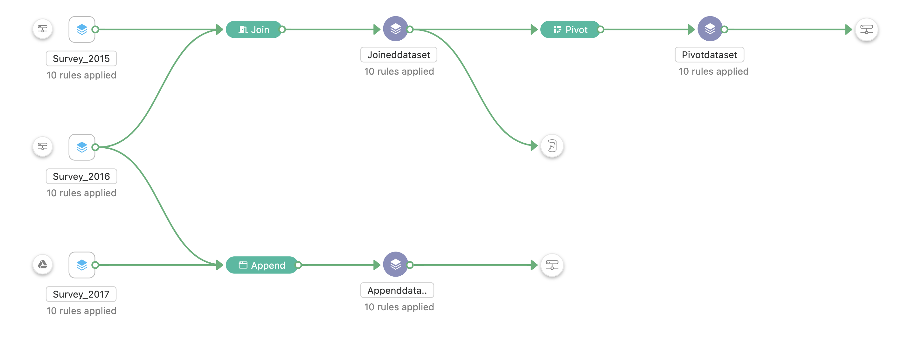

# Embed Takehome - 

To setup:
```bash
npm install
```

To run:
```bash
npm run dev
```

## Things to try:

1. Drag around nodes!
2. Zoom in and out
3. Pan around the screen

## Resources

Links:

- [React Flow - Docs](https://reactflow.dev)
- [React Flow - Discord](https://discord.com/invite/Bqt6xrs)

Learn:

- [React Flow – Custom Nodes](https://reactflow.dev/learn/customization/custom-nodes)
- [React Flow – Layouting](https://reactflow.dev/learn/layouting/layouting)
